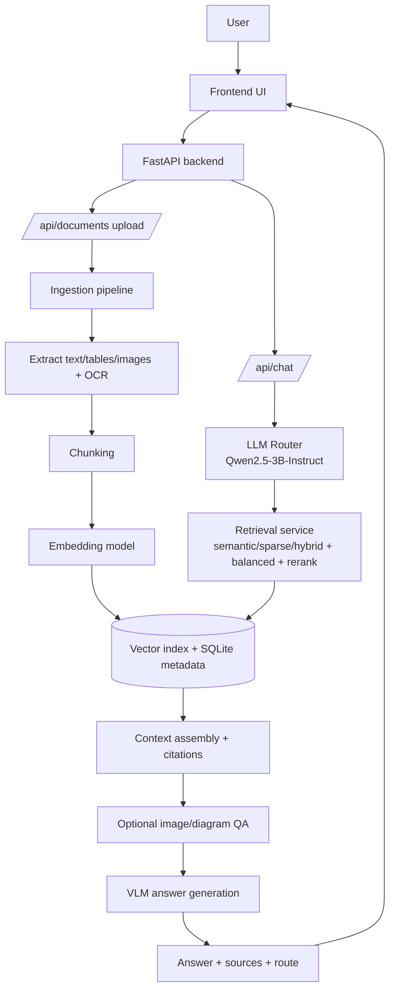

# Doc Chatbot (Local PoC)

Local, low-latency document ingestion + retrieval + chat pipeline designed for a 16GB RTX 3070.
This PoC uses **InternVL2.5-2B** for multimodal understanding and a lightweight text embedding model for retrieval.

## Quick start
1) Create venv and install deps
```powershell
python -m venv .venv
./.venv/Scripts/Activate.ps1
pip install -r requirements.txt
```

2) Copy config
```powershell
Copy-Item .env.example .env
```

3) Run server
```powershell
python -m backend.app
```

Open: http://127.0.0.1:8000

## Where to upload documents
- Web UI: http://127.0.0.1:8000 (upload form)
- Or drop files into: `D:/shaun/projects/doc_chatbot/data/uploads`
  - Then run: `python scripts/ingest_folder.py`

## Supported file types
- Office: `.pdf`, `.pptx`, `.docx`, `.xls/.xlsx/.xlsm/.xltx/.xltm`, `.odt/.ods/.odp`
- Text-like: `.txt`, `.md`, `.csv`, `.tsv`, `.json`, `.yaml/.yml`, `.xml`, `.html/.htm`, `.rtf`, `.log`
- Images/diagrams: `.png`, `.jpg/.jpeg`, `.tiff`, `.bmp`, `.gif`, `.webp`
- For unknown or missing extensions, ingestion now attempts a best-effort parser fallback (zip-based Office detection, PDF probe, then text decode).

## Multi-document reasoning
- Chat retrieval now includes filename/date-aware source context.
- Comparison prompts (e.g. "how did this change between 2020 and 2026") use balanced retrieval across documents and structured compare instructions.
- For compare intent, the system attempts per-document evidence coverage before generating an answer.

## Retrieval upgrades
- Retrieval now supports `semantic`, `sparse` (BM25), and `hybrid` (RRF fusion of dense+sparse).
- A reranker stage can reorder top candidates before generation.
- Router-provided `retrieval_plan.strategy` is now applied at query time.
- `.env` controls:
  - `RETRIEVAL_MODE=hybrid`
  - `ENABLE_RERANKER=true`
  - `RERANK_MODEL_ID=cross-encoder/ms-marco-MiniLM-L-6-v2`
  - `RERANK_DEVICE=auto`
  - `RERANK_TOP_N=20`

## LLM Router (local)
- Chat routing can use a local text-only LLM for intent/planning instead of hardcoded keyword triggers.
- Default router model: `Qwen/Qwen2.5-3B-Instruct`.
- Router output schema includes: `task_type`, `needs_cross_doc`, `needs_image_reasoning`, `retrieval_plan`, `confidence`.
- If router confidence is low or routing fails, the app falls back to heuristic routing.
- `.env` controls:
  - `ENABLE_ROUTER=true`
  - `ROUTER_MODEL_ID=Qwen/Qwen2.5-3B-Instruct`
  - `ROUTER_DEVICE=auto`
  - `ROUTER_MAX_NEW_TOKENS=196`

## Router verification
- Health status:
```powershell
python -c "import requests, json; print(json.dumps(requests.get('http://127.0.0.1:8000/api/health', timeout=10).json(), indent=2))"
```
- Trigger chat and inspect route:
```powershell
python -c "import requests, json; r=requests.post('http://127.0.0.1:8000/api/chat', json={'message':'How did my resume change between 2020 and 2026?'}, timeout=30); d=r.json(); print(json.dumps(d.get('route'), indent=2)); print('intent=', d.get('intent'))"
```
- Router is active when `route.source` is `llm_router`.

## Retrieval evaluation harness
- Create a labeled eval set JSON (see `data/eval/retrieval_eval_sample.json` for schema).
- Run:
```powershell
python scripts/evaluate_retrieval.py --eval-set data/eval/retrieval_eval_sample.json --mode hybrid --k 1,3,5,10
```
- Optional:
  - `--no-rerank` to measure baseline retrieval without reranking.
  - `--mode semantic|sparse|hybrid|image_first` to compare retrieval strategies.
- Report includes aggregate and per-slice metrics: `recall@k`, `mrr@k`, `ndcg@k`.

## Diagram/image QA behavior
- Image chunks now store `metadata.image_path` and are saved under `data/processed/<doc_id>/images/`.
- Chat detects image/diagram questions and runs query-time multimodal QA on the original image files (instead of trusting a single pre-indexed caption).
- OCR text is still indexed for retrieval context, but image interpretation now happens at question time.
- Re-ingest existing image/PDF/PPT documents after updating, so image paths are populated in stored chunk metadata.
- Diagram answers now apply OCR confidence gating with generic layout parsing (OCR text boxes + inferred flow graph), so fallback behavior does not rely on fixed domain marker lists.
- A multi-stage diagram pipeline now runs at ingestion for images:
  - Stage 1: layout/text extraction (OCR nodes + initial edges)
  - Stage 2: semantic node typing and entity/time tagging
  - Stage 3: relationship inference and edge typing
  - Stage 4: graph quality/confidence scoring
  - Stage 5: graph summary generation for retrieval context
- Structured outputs are persisted in SQLite `diagram_graphs` and additionally indexed as retrieval chunks with source types:
  - `diagram_graph`, `diagram_node`, `diagram_edge`
- Chat prefers persisted diagram graph evidence for image reasoning and falls back to OCR layout parsing when graph data is unavailable.
- Inspect persisted graphs for a document:
  - `GET /api/documents/{doc_id}/diagram-graphs`
- Optional `.env` controls:
  - `ENABLE_DIAGRAM_PIPELINE=true`
  - `DIAGRAM_MAX_NODE_CHUNKS=24`
  - `DIAGRAM_MAX_EDGE_CHUNKS=24`

## OCR tuning
- OCR preprocessing now includes upscaling, contrast normalization, sharpening, denoising, and region-based OCR passes.
- Optional `.env` controls:
  - `OCR_TESSERACT_OEM` (default `3`)
  - `OCR_TESSERACT_PSM` (default `6`)
  - `OCR_REGION_GRID` (default `2`)
  - `OCR_UPSCALE` (default `2.0`)

## Notes for scanned PDFs
- OCR uses Tesseract. Install it and set `TESSERACT_CMD` in `.env` if it is not on PATH.
- For best OCR results, use 200-300 DPI scans.

## Models
- Multimodal: `OpenGVLab/InternVL2_5-2B`
- Embeddings: `BAAI/bge-small-en-v1.5`

If you need a Hugging Face token for model downloads, set `HF_TOKEN` in your environment.

## Provider switching (Local vs OpenAI)
- You can run local models, OpenAI models, or a mix:
  - `MODEL_PROVIDER=local|openai` (answer generation)
  - `ROUTER_PROVIDER=local|openai` (routing/planning)
  - `EMBED_PROVIDER=local|openai` (retrieval embeddings)
- Recommended OpenAI defaults:
  - `OPENAI_CHAT_MODEL=gpt-4o-mini`
  - `OPENAI_ROUTER_MODEL=gpt-4o-mini`
  - `OPENAI_EMBED_MODEL=text-embedding-3-small`
- Put your API key in `.env`:
  - `OPENAI_API_KEY=<your_key_here>`
- Important: if you switch embedding provider/model, re-ingest documents so vectors are rebuilt in the same embedding space.

## Project layout
```
doc_chatbot/
  backend/        # API + ingestion + retrieval + chat
  frontend/       # simple UI
  scripts/        # CLI ingestion helpers
  data/
    uploads/      # drop files here
    processed/    # extracted artifacts
    index/        # embeddings + metadata
    db/           # sqlite
```

## Workflow diagram


## Troubleshooting
- If the VLM fails to load, set `ENABLE_VLM=false` to run in retrieval-only mode.
- For GPU torch: install the CUDA-enabled PyTorch wheel separately if needed.
